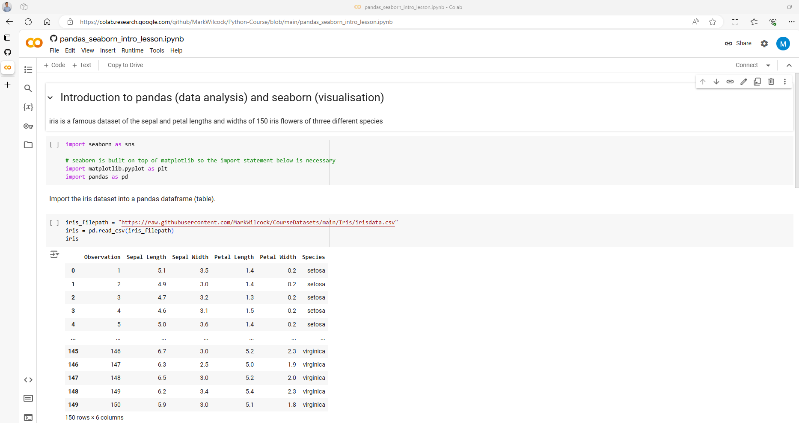
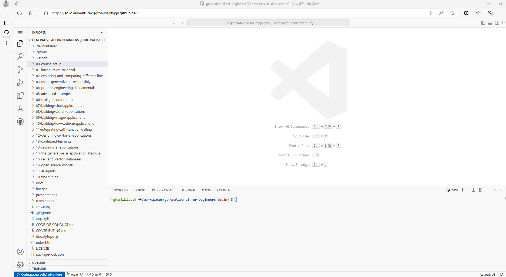

# Setup Python for the Course

This is a very practical course and we will write and execute Python code in the lab exercises.  Attendes must have the ability to run Python. There are a few ways to do this.  The easiest way is to run Python via a browser either using the Google Colab or GitHub Codespaces services.  As of the time of writing, both of these have free versions but check this when you sign up to the service.

## Google Colab

Colab is a service provided by Google that allows us to write and execute Python in our browser without any need for set up or configuration.  For this option, you will need a Google account.  You may already have one but if not you can create one for free. 

I’ve created a short video on YouTube (less than 3 minutes) that shows you how to do this at https://youtu.be/HcUZ5xbdvro .

Here are brief step-by-step instructions.
1. In a browser, go to https://colab.research.google.com/. Have a quick read of the informationn on this introduction page.
1. Use the blue button at top right of the page to sign in (or create a new free Google account).  This may involve some two factor autentication message to your mobile or email.
1. From the menu, click on File then Open Notebook. A dialog box appears.  Choose GitHub from the vertical list of the left and enter https://github.com/MarkWilcock/Python-Course into the "Enter a GitHib URL..." text box
1. This will show a list of the Python notebooks in this course.  Select a notebook.  One good choice for getting started is 'pandas_seaborn_intro_lesson.ipynb'
1. his should bring up a browser page with a Colab development environment that looks like this.  If you get here Congratulations!

## GitHub Codespaces

GitHub Codespaces also offers a Python (and other) environemnt from the browser.  The Python environment uses a very nice code editor, VSCode.

Here are brief step-by-step instructions.
1. In a browser go to  https://github.com/features/codespaces
1. Click on the "Get started for free" button
1. Sign in with an email address (or create a new free account).  This may involve some two factor autentication message to your mobile or email.
1. Navigate to the this course's repo https://github.com/MarkWilcock/Python-Course
1. Click on the  green "Code" button then the "Codespaces" tab then "Create Codespaces on main"
1. This should bring up a browser page with a VSCode development environment that looks like this.  If you get here Congratulations! 

## Microsoft Fabric
This is an option only if your company has provided you with access to a Microsoft Fabric workspace.

## Local Install with VSCode

If you would like to install Python locally on your PC or Mac,  I would recommend using VSCode, a very popular code editor.  Here are the steps in brief.

1. Download and install Python from https://www.python.org/downloads/
1. Download and install VSCode from https://code.visualstudio.com/download 
1. Launch VSCode and install the Python and then the Jupyter extensions
1. Clone this Python Course https://github.com/MarkWilcock/Python-Course (I suggest that you do not select a folder on a OneDrive since the virtual environent you will create later has thousands of small files which OneDrive will need to sync.)
1. Create a virtual environment (from the command palette with Ctrl-Shift-P)
1. Install the following packages, used in the course, into the virtual environment: requests, pandas, seaborn, requests, matplotlib
1. Test that everything is working. Open one of the Python notebooks from the course folder, select the virtual environemt, then executes soem of teh code cells

